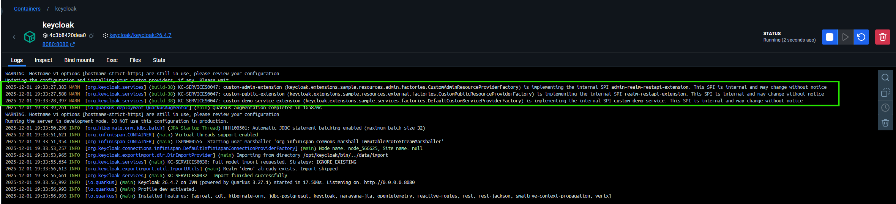
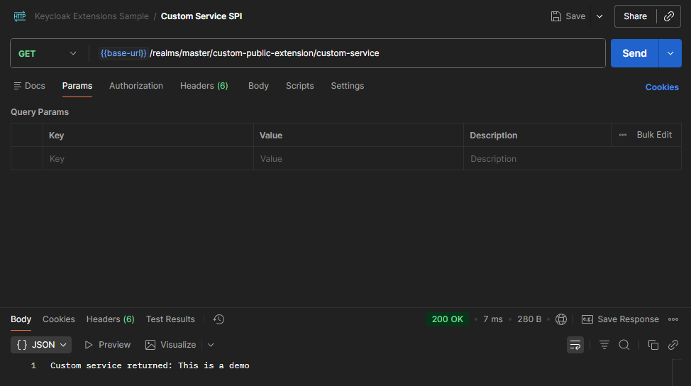
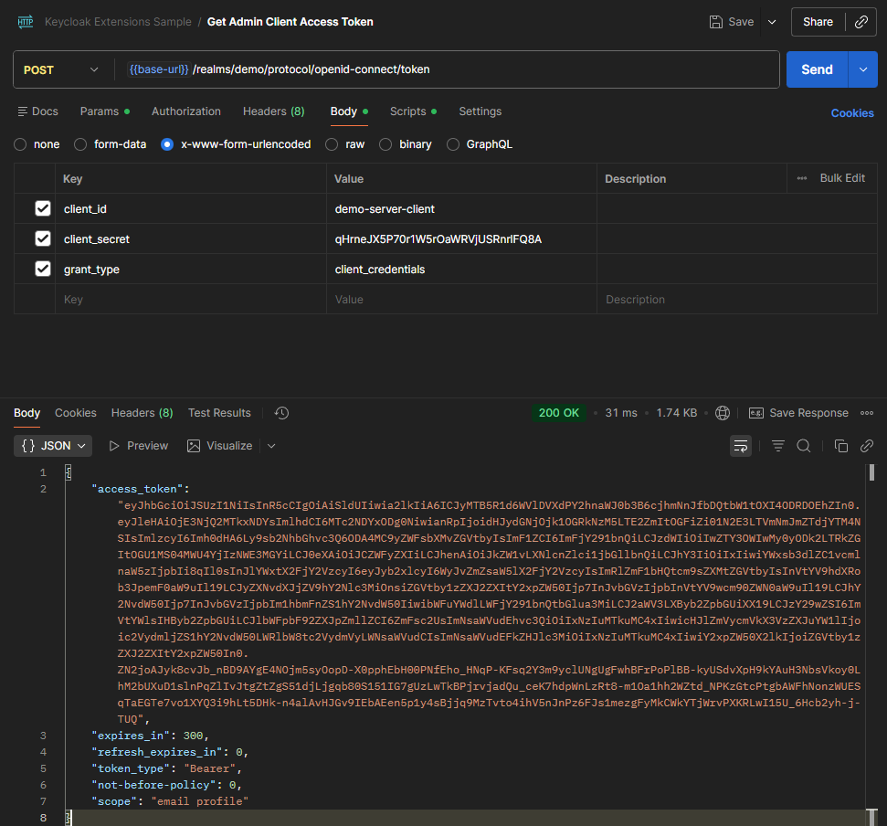
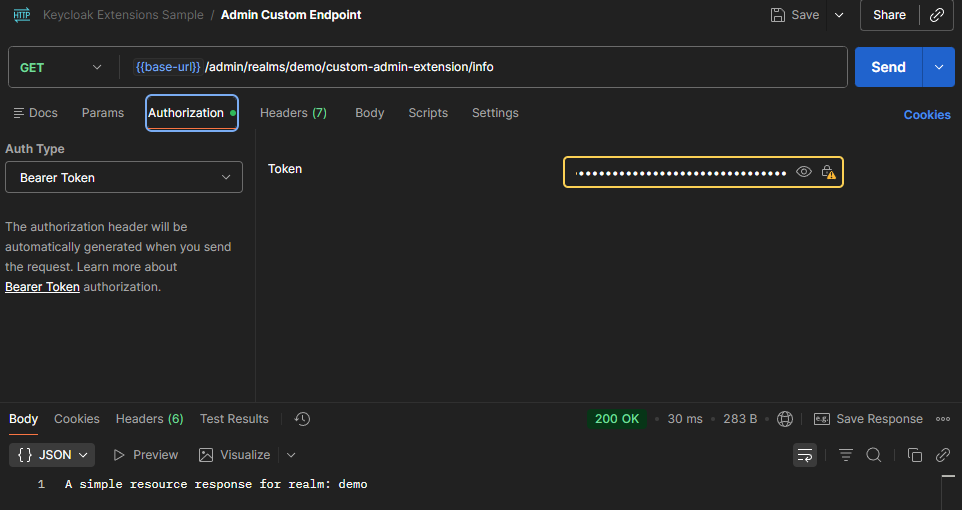

# keycloak-extensions-sample

Demo project for showing how to extend Keycloak with custom SPIs

## How to start the project

1. Open a terminal in the project root.
2. Run the following command:

```bash
docker compose up
```

3. Open [http://localhost:8080](http://localhost:8080) in your browser. (User: admin, Password: admin)
4. Go to **Manage Realms** → **demo** → **Clients** → **demo-server-client** → **Credentials** and press **Regenerate** for Client secret. This secret will be used for Postman.

---

## Testing changes

Every code change requires you to rebuild the project:

```bash
mvn clean package
```

Confirm within docker container view that extensions were registered:



---

## How it works

This project demonstrates how to create and register custom Keycloak SPIs (Service Provider Interfaces) for extending Keycloak functionality.

### Custom Admin Resource SPI

- `demo/src/main/java/keycloak/extensions/sample/resources/admin/factories/CustomAdminResourceProviderFactory.java`: Defines the custom endpoint factory.
- `demo/src/main/java/keycloak/extensions/sample/resources/admin/providers/CustomAdminResourceProvider.java`: Implements the provider logic.
- `demo/src/main/java/keycloak/extensions/sample/resources/admin/resources/CustomAdminResource.java`: Contains the actual resource implementation (REST endpoint).

These classes must be explicitly registered in:

- `demo/src/main/resources/META-INF/services/org.keycloak.services.resources.admin.ext.AdminRealmResourceProviderFactory`

This registration enables Keycloak to discover and load your custom SPI at runtime.

### Custom Public Resource SPI

- `demo/src/main/java/keycloak/extensions/sample/resources/external/factories/CustomPublicResourceProviderFactory.java`: Defines the custom public endpoint factory.
- `demo/src/main/java/keycloak/extensions/sample/resources/external/providers/CustomPublicResourceProvider.java`: Implements the provider logic for the public resource.
- `demo/src/main/java/keycloak/extensions/sample/resources/external/resources/CustomPublicResource.java`: Contains the actual public resource implementation (REST endpoint).

These classes must be explicitly registered in:

- `demo/src/main/resources/META-INF/services/org.keycloak.services.resource.RealmResourceProviderFactory`

This registration enables Keycloak to discover and load your custom public SPI at runtime.

### Custom Service SPI

This SPI allows you to define custom services and extend Keycloak with new provider logic and multiple implementations.

- `demo/src/main/java/keycloak/extensions/sample/services/spis/CustomServiceSpi.java`: Declares the SPI and registers it with Keycloak. Must be registered in `META-INF/services/org.keycloak.provider.Spi` using the value `keycloak.extensions.sample.services.spis.CustomServiceSpi`.
- `demo/src/main/java/keycloak/extensions/sample/services/providers/CustomServiceProvider.java`: Interface extending `Provider`, where you can declare new methods for your service logic.
- `demo/src/main/java/keycloak/extensions/sample/services/factories/CustomServiceProviderFactory.java`: Interface extending `ProviderFactory`, allowing you to define multiple provider implementations.

**Registration:**

Add the fully qualified class name of your SPI (`keycloak.extensions.sample.services.spis.CustomServiceSpi`) to:

- `demo/src/main/resources/META-INF/services/org.keycloak.provider.Spi`

This enables Keycloak to discover and load your custom SPI and its providers at runtime.

#### Registering Provider Implementations

To register a provider factory and its implementation:

- `demo/src/main/java/keycloak/extensions/sample/services/factories/DefaultCustomerServiceProviderFactory.java`: The factory for your default provider implementation.
- `demo/src/main/java/keycloak/extensions/sample/services/providers/DefaultCustomerServiceProvider.java`: The default provider implementation.

**Registration:**

Add the fully qualified class name of your factory (`keycloak.extensions.sample.services.factories.DefaultCustomerServiceProviderFactory`) to:

- `demo/src/main/resources/META-INF/services/keycloak.extensions.sample.services.spis.CustomServiceSpi`

This enables Keycloak to discover and use your default provider implementation at runtime.

### How to test

#### Public Endpoints

To test the public endpoints, use the following commands:

```bash
# Public custom endpoint
curl --location 'http://localhost:8080/realms/demo/custom-public-extension'
```


```bash
# Using Custom Service SPI
curl --location 'http://localhost:8080/realms/master/custom-public-extension/custom-service'
```



#### Admin Endpoints

First, obtain an access token for an authorized client:

```bash
curl --location 'http://localhost:8080/realms/demo/protocol/openid-connect/token' \
	--header 'Content-Type: application/x-www-form-urlencoded' \
	--data-urlencode 'client_id=demo-server-client' \
	--data-urlencode 'client_secret={PUT-YOUR-CLIENT-SECRET-FROM-KEYCLOAK-DEMO-SERVER-CLIENT}' \
	--data-urlencode 'grant_type=client_credentials'
```



Then, use the access token to access the admin endpoint:

```bash
curl --location 'http://localhost:8080/admin/realms/demo/custom-admin-extension/info' \
	--header 'Authorization: Bearer <accessToken>'
```


